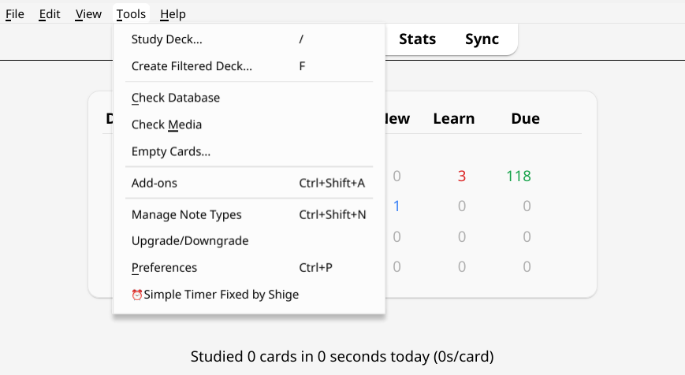

# README.md

# Computer Modern fonts for Anki

Beautifully format your Anki cards with **Computer Modern** fonts: 

- **CM Bright** for body text
- **CM Typewriter Light** for code/monospace

These render well on screens and complement LaTeX/MathJax/KaTeX expressions. 

**This repo:**

1. Packages the font (`.ttf`) files and a corresponding CSS styling snippet.
2. Gives a brief tutorial &mdash; see below &mdash; on how to use the files in (1) to apply these fonts to your Anki cards.

**Example card:**

## Tutorial (Anki Desktop)

1. **Add font files to Anki media folder**
    
    Copy the `.ttf` files from this repo’s `fonts/` folder into your Anki profile’s `collection.media` folder:
    
    - Linux: `~/.local/share/Anki2/<YourProfile>/collection.media`
    - macOS: `~/Library/Application Support/Anki2/<YourProfile>/collection.media`
    - Windows: `%APPDATA%\\Anki2\\<YourProfile>\\collection.media`
    
    More information in Anki manual: [https://docs.ankiweb.net/files.html](https://docs.ankiweb.net/files.html)
    
2. **Open Anki styling editor**
    
    Go to *Manage Note Types* (`Ctrl+Shift+N`).
    
    
    
    Now select the note type whose cards' styling you’d like to change (e.g. Basic), then click *Cards*.
    
    
    
    Under the *Card Type* drop down, select the card type you're interested in (e.g. the *Front->Back* for the *Basic* note type). Then, navigate to *Styling* by clicking corresponding radio dial.
    
    
    
3. **Change CSS styling to apply fonts**
    
    Anki cards are displayed as rendered HTML, styled by CSS. In the last step, you opened the window where the CSS styling for this card type's HTML code lives.
    
    Change the `font-family` parameter (e.g. `arial`) to `‘cmu-bright'`.
    
    Now copy the CSS code snippet from `css/anki-cmu.css` into the top of this text box, without deleting the other formatting (e.g. `.card{…}` or `.cloze{…}`).
    
    
    
    **Note:** You can partially inspect the changes by viewing the *Preview* pane on the right-hand side of the window.
    
    e.g.
    
    Original formatting (Arial)
    
    
    
    New formatting (Computer Modern Bright)
    
    
    
    To check other formatting changes, however, (e.g. boldface, italic, formatting for `<code>` tags), you’ll have to add cards and preview changes.
    
4. **Save — add notes**
    
    Click *Save* and you’re done. New and existing notes of the altered card type should now appear with the desired fonts.
    

### Notes and FAQs

- **Will this sync to mobile?** Yes.
- **Other fonts?** Anki takes `.ttf` font formats, among others. For other Computer Modern fonts, you can source the `.ttf` files from Christian Lawson-Perfect’s GitHub repo: [https://github.com/dominictarr/computer-modern/tree/master](https://github.com/dominictarr/computer-modern/tree/master). See his helpful website [Using Computer Modern on the Web](https://www.checkmyworking.com/cm-web-fonts/) for more information. To use these fonts in Anki, simply pattern match on the tutorial above and change the CSS code accordingly.
- **`.ttf` files names:** If you rename the `.ttf` files, you should keep the leading underscores (`_`). Otherwise Anki’s media cleanup will flag these files as unused media, and you may accidentally delete them.
- **Useful Anki links:**
    - Where to find your `collection.media` folder: [https://docs.ankiweb.net/files.html#user-data](https://docs.ankiweb.net/files.html#user-data)
    - Installing fonts: [https://docs.ankiweb.net/templates/styling.html#installing-fonts](https://docs.ankiweb.net/templates/styling.html#installing-fonts)
- **Attribution:** This repo merely repackages the CM Bright and CM Typewriter Light fonts, along with a CSS snippet and instructions on how to use these in Anki. See `ATTRIBUTION.md` for detailed credits on the development of these fonts.

### License

#### Fonts in `fonts/`

All fonts in this repo are under **SIL Open Font License 1.1 (OFL‑1.1)**. These CMU fonts are authored/compiled from Andrey V. Panov’s **Computer Modern Unicode** project (OFL‑1.1). See `fonts/OFL` and `fonts/OFL-FAQ`. 

#### Everything else

Aside from the `.ttf` font files, everything in this repository (i.e. docs and CSS code) is under the [WTFPL v2](https://www.wtfpl.net/) license (see: `LICENSE`). This is a maximally permissive license — feel no compunction, do as you please! This project is merely here to spare you some tedium.

> **No warranty:** This repository is provided “AS IS”, without warranty of any kind.
